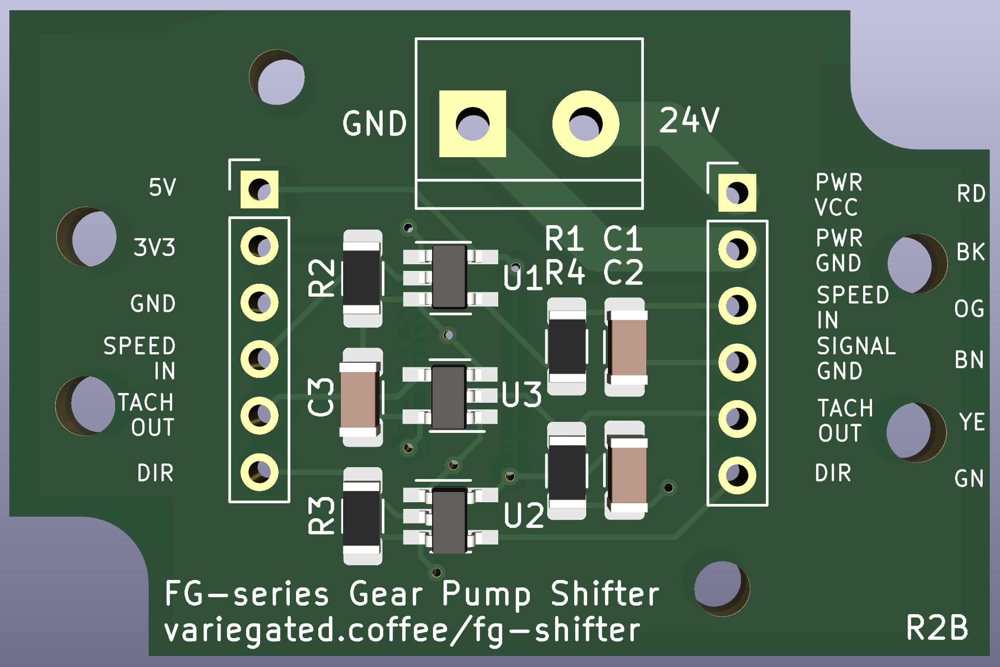
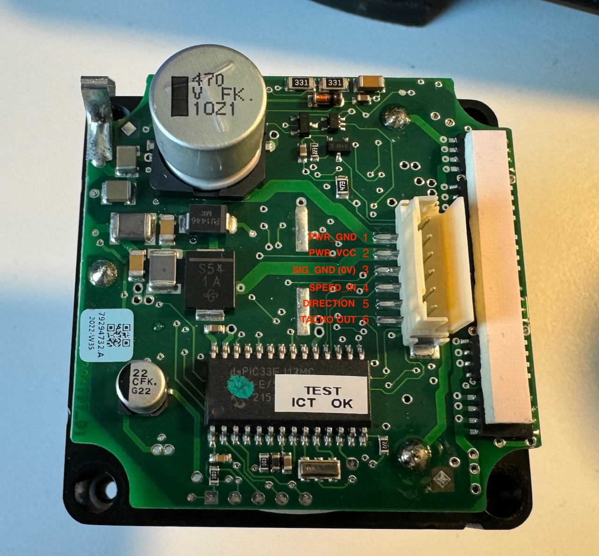

# FG Level Shifter

Fluid-o-tech FG20x/30x/40x gear pumps run at 5V, but Variegated Coffee boards prefer 3V3. The pumps also prefer a smooth control signal. PWM signals aren't. This is a really tiny board designed to fit into a Hammond 1551G project box allowing you to shift between 5V and 3V3, and to add an RC filter to smooth out the PWM signal.

*R2B is the current revision, but is yet to be manufactured. You shouldn't be the first to do so.*

## Features

* PCB outline matching a Hammond 1551G project box
* Terminal block for 24V power
* Connection to pump and to the controller can use either a terminal block, or something like a right-angled JST-XH connector
* 1206 and SOT-23-5 components for relatively easy hand soldering
* Extra holes for adding zip ties as strain relief

## Cabling

If you open up a FG series pump, you'll find the the stock cable is attached using a connector. That connector is a TE AMP CT 6 position connector (2.00 mm pitch). If you're unhappy with the stock cable, you should be able to create a new one.

## Changelog

* R1A -> R1B
  * Fixed hole positions
* R1B -> R2A 
  * Changed the board to not just be an RC filter, but to also do level shifting
* R2A -> R2B
  * Added bypass caps and Variegated coffee logo
  * Changed pinouts on connectors, to keep optional pins towards one edge
